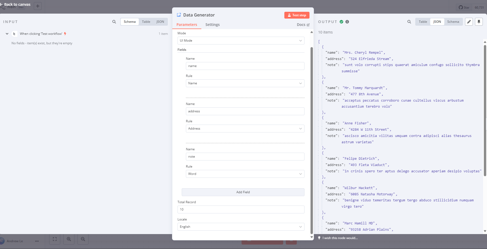

# n8n-nodes-data-generator

This is a custom n8n node designed to generate dummy data using the Faker.js library in your n8n workflows.

Faker.js is a popular library for generating fake data for various purposes, such as testing and development.

[n8n](https://n8n.io/) is a [fair-code licensed](https://docs.n8n.io/reference/license/) workflow automation platform.

[Operations](#operations)  
[Compatibility](#compatibility)  
[Usage](#usage)
[Installation](#installation)

## Operations

Generate dummy data based on defined rules using Faker.js.

## Compatibility

This node is compatible with FakerJS v8.4.1. Please ensure you are using a compatible version of FakerJS.

## Usage

This application provides three modes to define rules for generating mock data:

### Simple Mode

This is the simplest mode. You only need to enter the field name on each line. The tool will automatically select the appropriate rules based on the field name.
You can specify rules for each field by defining them in the format:

```
id:number.int(1000)
name
email:internet.email()
```

### UI Mode

You can add fields and rules directly through the UI.



### Advanced Mode

This is the professional mode if you want to define rules by defining a JSON object.
In this mode, you can use faker.js rules with custom parameters.

```
[
  {"name": "id", "rule":"number.int(100000)"},
  {"name": "email", "rule":"internet.email()"},
  {"name": "firstName", "rule":"name.firstName()"},
  {"name": "lastName", "rule":"name.lastName"},
  {"name": "address", "rule":"address.streetAddress"},
  {"name": "city", "rule":"address.city()"},
  {"name": "state", "rule":"address.state"},
  {"name": "zip", "rule":"address.zipCode"}
]
```

A full list of rules can be found on the faker.js homepage: [Faker.js API](https://v8.fakerjs.dev/api/)

Hint: In this mode, you can use AI with the prompt:

```
I am a programmer, and I have a list of database fields entered by users: "id", "created_at", "updated_at", "deleted_at", "name", "email".
I need to convert this list of fields into corresponding Faker.js rules in the following format: [{"name": "email", "rule": "internet.email"}].
I need you to return only the generated code.
```

Select the number of records to generate. The system will automatically create the requested number of records as shown below:

```
[
  {
    "email": "Cleo.Wunsch@hotmail.com",
    "firstName": "Andrew",
    "lastName": "Mueller",
    "address": "158 Jaren Fall",
    "city": "South Gwendolyn",
    "state": "Washington",
    "zip": "31295"
  }
]
```

Supports all Faker.js APIs as documented: [Faker.js API](https://fakerjs.dev/api/)

## Installation

To install a custom node in n8n, follow these steps:

1. Refer to the official documentation: [n8n Custom Node Installation](https://docs.n8n.io/integrations/community-nodes/installation/)

2. Choose the custom node you want to install, for example, `n8n-nodes-data-generator`.

3. Follow the instructions provided in the documentation to install and configure the custom node.

For detailed installation steps and configuration options, please visit the official n8n documentation linked above.
